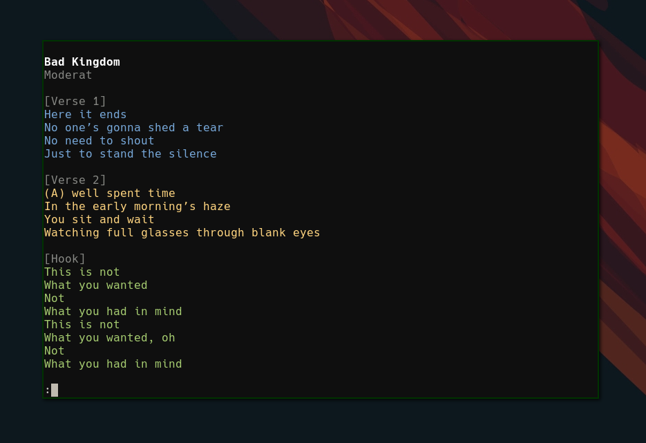

# lyric

Song lyrics in your terminal via the [Genius API](https://docs.genius.com).



## Usage

Search by song name, artist, parts of lyrics, or a combination.

```bash
lyric "bohemian rhapsody"
lyric "queen"
lyric "Is this the real life? Is this just fantasy?"
```

## Install

Install with go:

```bash
go install github.com/liamg/lyric/cmd/lyric
```

...or [download the latest binary](https://github.com/liamg/lyric/releases/latest).

## Configuration

You don't need to do any real configuration, but you'll need a Genius account. Lyric will pop your browser open to authenticate with Genius on first use, then you're all set. You'll be prompted again if reauthentication is ever needed.
